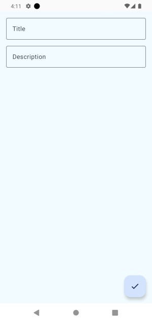
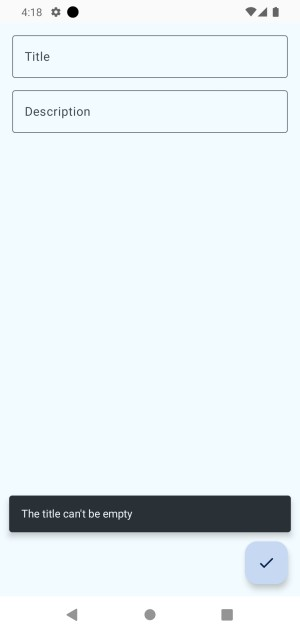
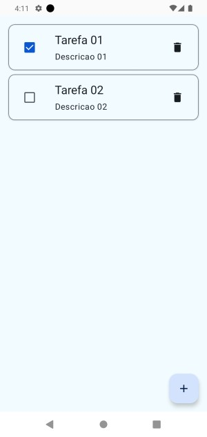

# android_todo_list
android_todo_list

Projeto Android usando o JetPack Compose
Banco de dados Room

O projeto é uma lista de tafera simples com a funcionalide de salvar, deletar e recupera tarefas do banco de dados Room.
- Criar tarefa
- Editar tarefa
- Deletar tarefa
- Listar tarefas

- Marcar tarefa como completa (Checkbox)

  

